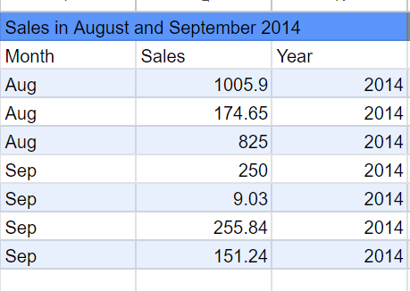

# SkilHarvest-Data-Analysis
This is where I documented my first project while learning data analysis with SkillHarvest

## Data Source
Data was gotten from skilharvet instructor named SkilHarvest-stationary-supplies [Download Here](Skilharvest-Stationary-Supplies.csv) 

## Data Analysis
The basic lines of codes used during analysis on SkilHarvest Stationary supply are thus;
```
=QUERY(A1:H44,"SELECT C,H,F WHERE (C='Binder' OR C='Pencil')AND F=2015",1)
=QUERY(A:H,"SELECT A,H,F WHERE (A='Central' OR A='East') AND F=2014",1)
=QUERY(A1:H44,"SELECT E,H,F WHERE (E='Aug' OR E='Sep')AND F=2014",1)
=QUERY(A:H,"SELECT A,B,C,H,F WHERE C LIKE 'Pen%'",1)
=QUERY(A:H,"SELECT C,A,B,F WHERE C LIKE '%sk'",1)
```
## Result/Findings
This is the insight gotten from the analysis made on this project.



