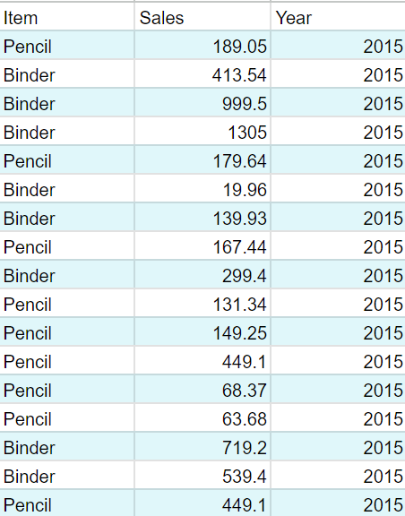
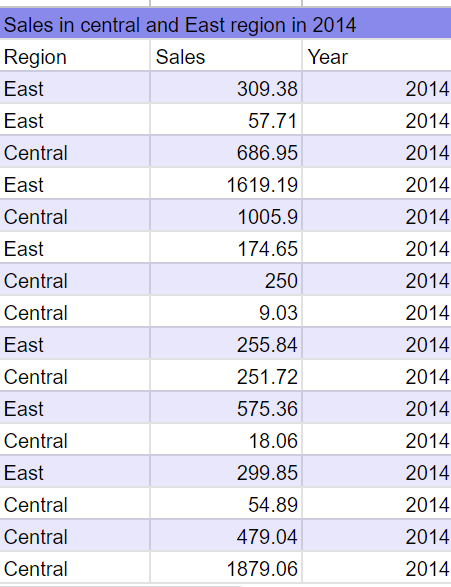
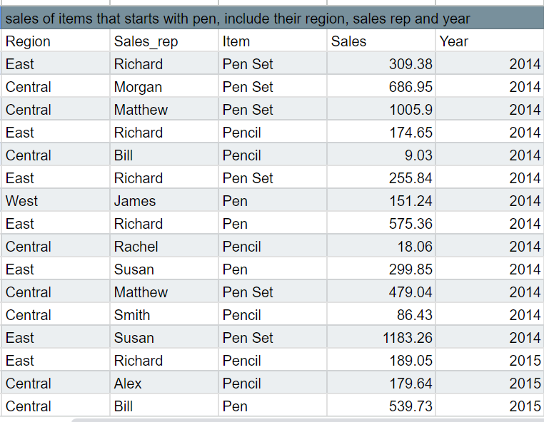
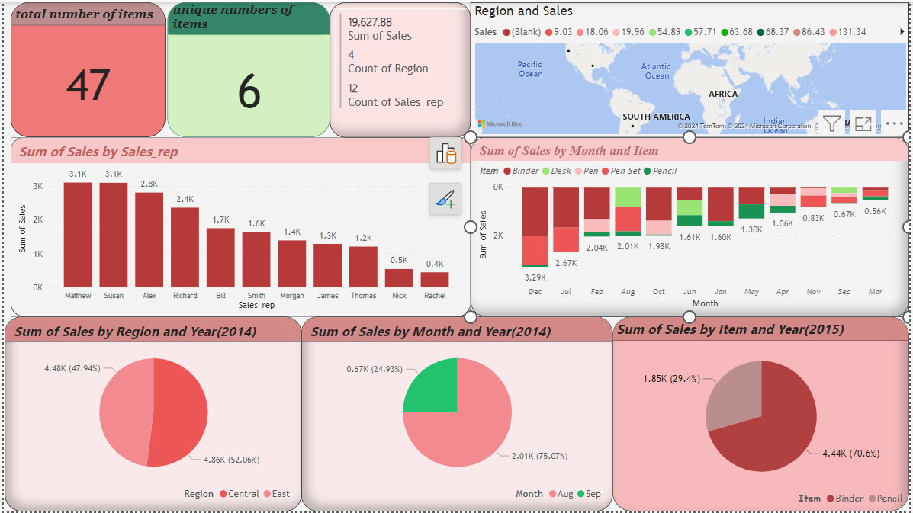

# SkilHarvest-Data-Analysis
This is where I documented my first project while learning data analysis with SkilHarvest

## Data Source
Data was gotten from skilharvet instructor named SkilHarvest-stationary-supplies [Download Here](https://docs.google.com/spreadsheets/d/1kIvUpU3t4_vJs3SVGH7i9hhOciQ8FELTxFv4CDy7WVA/edit#gid=32712049) 

## Data Analysis
Tools used for this analysis are; 
- Google Sheet
- PowerBI
  
    Using google sheet to analyse the data at hand, 
  
#### 1. Sales of binder items and pencil in 2015
```
=QUERY(A1:H44, "SELECT C,H,F WHERE (C='Binder' OR C='Pencil')AND F=2015",1)
```


#### 2. Sales in Central and East region in 2014
```
=QUERY(A:H,"SELECT A,H,F WHERE (A='Central' OR A='East') AND F=2014",1)
```


#### 3. Sales in August and September 2014
```
=QUERY(A1:H44,"SELECT E,H,F WHERE (E='Aug' OR E='Sep')AND F=2014",1)
```


#### 4. Show sales of items that start with Pen, include their region, sales rep and year.

```
=QUERY(A:H,"SELECT A,B,C,H,F WHERE C LIKE 'Pen%'",1)
```




#### 5. Sales of items that end with ‘sk’, include their region, sales rep and year
```
=QUERY(A:H,"SELECT C,A,B,F WHERE C LIKE '%sk'",1)
```


## Data Visualization  
The visualisation was carried out using powerBi


  

## 2.0 SkilHarvest Data-Analysis student data.
Here we have Skilharvest data analysis students that were present in a class. The data was gotten through google form where everyone input their details and submitted, then it was generated through google sheet. [Download here](https://docs.google.com/spreadsheets/d/1Hp13nKLnKwjWoG7JF4wMRDaTPqjo3LO1SzK9Uc4fVoM/edit#gid=1040980080)

#### Data Cleaning
- The names came in uppercases and lowercases so I capitalized each names so as to have a uniform text.
- I splitted the emails into columns
- Deleted duplicate rows
- Deleted an outliers
- Changed column names

  
